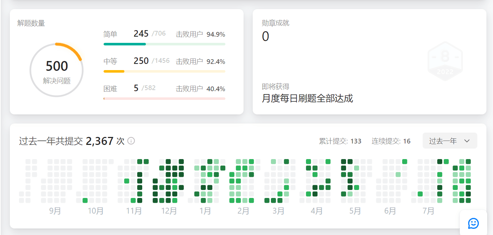

# Leetcode-summary
### 1、leetcode刷题历程
  - 2021/10/9号开始接触到有这个刷算法的网站。
  - 11月中旬开始刷题，起步艰难。
  - 12月份高强度刷题（这个时候进步飞快，截止12月25，刷了200道质量很高的题）。

  - 2022年1月份-2月份中旬，坚持每日，坚持了一个寒假。
  - 2022年上半年：2月下半月在公司实习，遂低频率刷题，4，5月份偶尔刷题。
  - 2022年8月份：坚持每日，主要是前缀和，滑动窗口，哈希表等题目。刷到了500题，Hard题是真得刷不明白。

  - 2023/2中上旬 23年2月份我开始复习总结leetcode刷题历程。把英文版的又刷了一遍，通过率百分之80多。

  - 2023/2月下旬 写了一个总结文档。各个模块的算法常见题型，以及各种题型重点考察的思维方法和一些常见的模版。例如二叉树->递归，递归模版，回溯模板。
  - 2023/8月下旬，本想按照<代码随想录>这些题目再多刷一些hard，想着还是等到研三秋招的时候再看吧。leetcode刷题先告一段落。

### 2、总结
  动态规划比较难，数据结构的题目较简单，前缀和，滑动窗口，哈希表等类型的题目经常一块使用。位运算总是搞得我头皮发麻。
  也算是马马虎虎地过了算法这一关，面试的话突击突击应该问题不大。经过一年多的熏陶，每每没有思路的时候，痛苦地抓头发，但是回顾下来，好好debug,或者认真看别人的题解。也能从中学到很多，还是那句话。坚持下来，能收获很多东西！加油！打工人！
  往后招聘的时候可以参考一下自己的题解复习复习，重点是多练一些hard，可以按照<代码随想录>去刷，然后周赛也可以多参加一下。

### 3、参考
- 动态规划参考: https://leetcode.com/discuss/general-discussion/458695/dynamic-programming-patterns
- 代码随想录: https://programmercarl.com/
- 宫水三叶的刷题日记 https://github.com/SharingSource/LogicStack-LeetCode
- 剑指offer： https://leetcode.cn/studyplan/coding-interviews/
- leetcode 热题100 : https://leetcode.cn/studyplan/top-100-liked/
